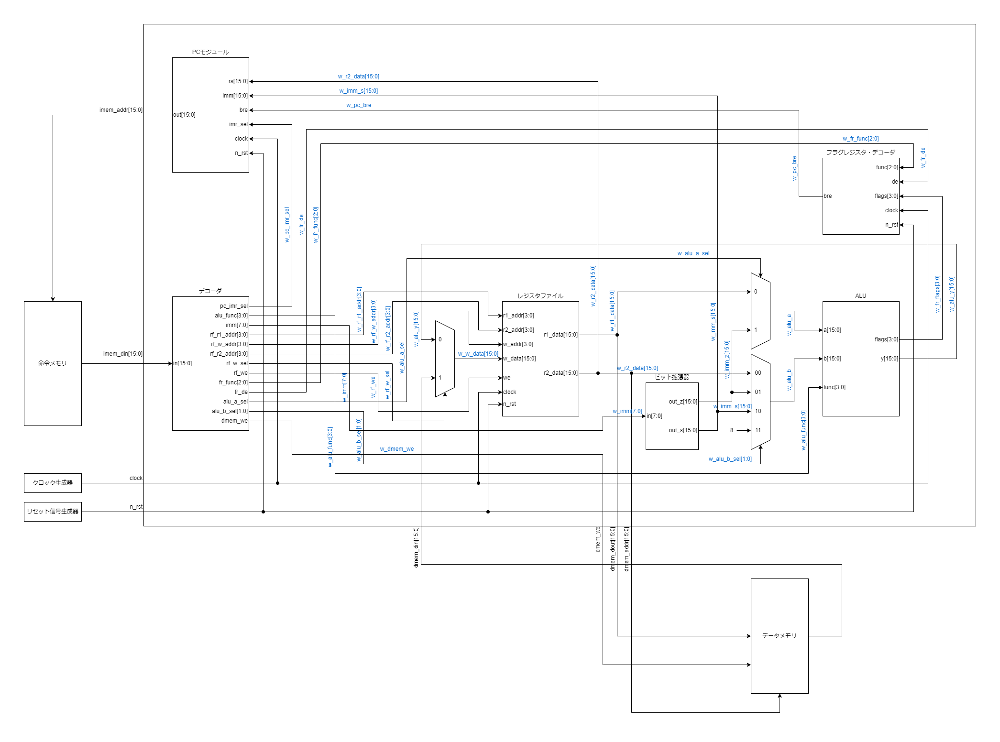

# ONC-16

## 経緯

以前，「CPUの創りかた」という書籍で紹介されている4bitCPUであるTD4，TD4を拡張した[8bitCPUのMY8CPU](https://github.com/kanade9600k/MY8CPU)を作成した。どちらも面白く，勉強になったが以下の点を拡張した新たなCPUを作りたくなった。

* TD4やMY8CPUを使っていたが，仕様が特殊
* 一般的なロード・ストアアーキテクチャを作ってみたかった
* しっかりとCPUの外部にメモリをおいて，通信をしたい
* パイプラインもできればやってみたい
* RISC-Vについても知っておきたい

そのため，16bitCPUを作ることを通してこれらを学んでいくことにした。

## 仕様

* 2アドレス方式（rd：Destination Registerとrs：Source Register）
* 固定長命令
* register-register型
* （将来的に）パイプライン
* ハーバードアーキテクチャ
* レジスタファイルはレジスタ16本

### ブロック図



### ドキュメント（詳細仕様）
[詳細についてはこちら](https://docs.google.com/document/d/1-sG39oUQBrACGRkaK3pZpzn-H-9ahUOX7ATbZHOXlv8/edit?usp=sharing)を参照（雑多に書いているので見ずらいかもしれません…）

## シミュレーション方法（CPU単体）

1. ディレクトリ移動

    ```bash
    cd cpu
    ```

2. 実行したいプログラムが入ったROMを選択(cpu/onc_16_tb.v内)

    ```verilog
    initial begin
        // デフォルトは123*456を計算するプログラム
        $readmemh("rom_multiplication.txt", imem);
    end
    ```

3. iverilogでコンパイル
    ```bash
    iverilog onc_16_tb.v
    ```

4. 実行

    ```bash
    vvp a.out
    ```

5. 波形表示

    ```bash
    gtkwave onc_16.vcd
    ```
    VSCodeなら`WaveTrace`という拡張機能もおすすめ

## 今後の予定

* 周辺回路の実装
  * メモリマップドI/Oについて調査
  * [ニキシー管表示器](https://github.com/kanade9600k/NixieIndicator.X)を自作CPUで動かしてみたい

* 割り込み処理の実装

* パイプラインの実装
  * 現状シングルサイクルで行っている
  * シングルサイクルとパイプラインでの性能・リソース比較をしたい
    * (2023/5/27) FPGA：10M08SCU169C8G，最大動作周波数：69.4 MHz, LEs：933 / 8,064 ( 12 % )，REGs：315
  * パイプラインハザード
    * 構造ハザード: データメモリと命令メモリを分けているので起こらないはず
    * データハザード: NOPで対応 or フォワーディング
    * 制御ハザード: NOPで対応

* アセンブラの作成
  * 現在は単に機械語に直すだけの簡単なもの
  * いずれは構文解析を行った変数等も処理できるもの

